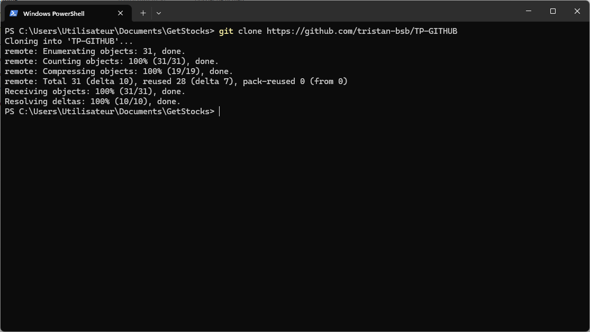
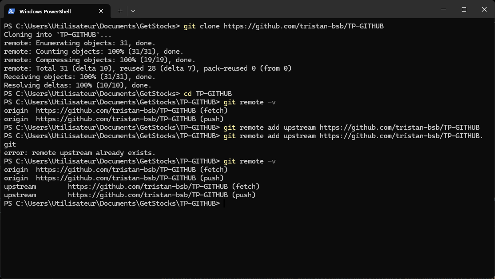
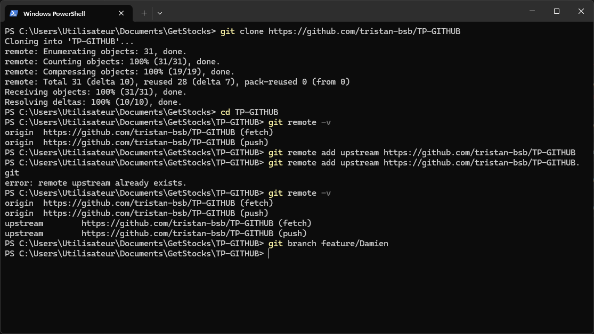
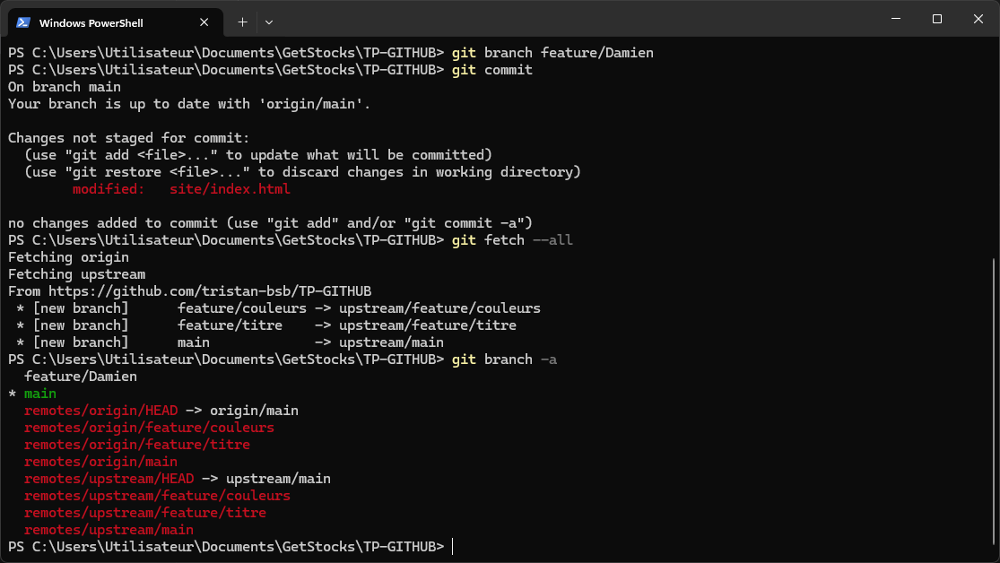
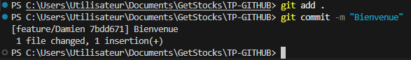
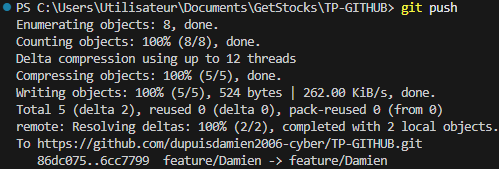

# Rendu de <NOM Prénom>

Une capture par étape, dans l'ordre. Terminal entier non rogné, invite visible.
Afficher l'historique en graphe quand c'est pertinent.

## Niveau 1
1. Configuration Git  
git clone https://github.com/tristan-bsb/TP-GITHUB  
  
cd TP-GITHUB  
git remote -v  
git remote add upstream https://github.com/tristan-bsb/TP-GITHUB.git  
  
2. Branche de travail
git branch feature/Damien

git fetch --all 
git branch -a 

3. Historique des commits
git add .
git commit -m "Bienvenue"

4. Pull Request
git push

5. Revue croisée
(capture)

## Niveau 2
6. Secret retiré du suivi
(capture)
7. Conflit résolu (marqueurs avant, graphe après)
(capture)
8. Revert du bandeau promo
(capture)
9. Issue fermée par une Pull Request
(capture)
10. Protection de main et CI au vert
(capture)

## Cible mobile
11. Commit distant récupéré et conflit résolu
(capture)

## Trois commits annotés
1. <hash> :
2. <hash> :
3. <hash> :
